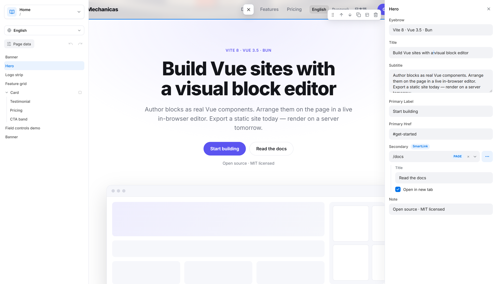
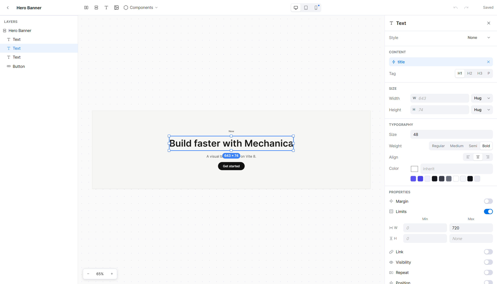

# Mechanica

[](https://www.npmjs.com/package/mechanica)
[](https://www.npmjs.com/package/create-mechanica)
[](./LICENSE)

Build Vue 3 websites with a visual block editor. You write **blocks**, ordinary Vue single-file components with a typed props schema, and arrange them into **pages** in an editor that runs on top of your live site. Pages are stored as readable Markdown files in your project, and `mechanica export` renders every page to static HTML.



- **Blocks are just Vue.** One compile-time macro, `defineBlock`, declares a block's props; everything else is plain Vue 3.
- **The editor is your site.** In development the editor overlays the real page: add blocks from a palette, edit props in forms, drag to reorder, undo and redo, manage pages.
- **Pages are files.** `.mech/pages/about.page.md` is Markdown with YAML props. Edit it in the editor, by hand or with an AI assistant, and get clean git diffs.
- **Static output, SEO included.** Per-page HTML and code splitting, sitemap, canonical URLs, hreflang and JSON-LD.

Built on Vite 8 and Vue 3.5. Sites run on Node.js 20.19+ or 22.12+ (npm, pnpm, yarn) or [Bun](https://bun.sh).

## Quick start

```bash
npm create mechanica@latest my-site
cd my-site
npm install
npm run dev
```

Open the URL Vite prints. The starter page appears with the editor on top of it. When you're ready to ship, `npm run export` writes a static site to `export/`.

**[Read the guide →](./packages/mechanica/README.md)** It covers blocks, pages, shared data, layouts, images, multi-language sites, queries and pagination, SEO, the CLI and every plugin option.

## A block and a page

A block is a `.vue` file in `src/blocks/`. `defineBlock` declares what editors can change and returns the props, typed:

```vue
<!-- src/blocks/Hero.vue -->
<template>
  <section class="hero">
    <h1>{{ props.title }}</h1>
    <p v-if="props.subtitle">{{ props.subtitle }}</p>
    <Link v-if="props.cta?.url" :to="props.cta">{{ props.cta.title }}</Link>
  </section>
</template>

<script setup lang="ts">
import { Link } from 'mechanica'

const props = defineBlock({
  name: 'Hero',
  props: {
    title: { type: 'string', default: 'Hello' },
    subtitle: 'text',
    cta: 'smartLink',
  },
  previewData: { title: 'Build sites visually', subtitle: 'Blocks are plain Vue components.' },
})
</script>
```

A page is a Markdown file whose path is its URL. The editor reads and writes this format, and so can you:

```markdown
---
name: About
data:
  head:
    title: About us
---

::: hero
title: About us
cta: { url: /contacts, title: Write to us }
@subtitle
We build fast websites
for people who care about the details.
:::
```

## Block Composer

Designers can build blocks without code: frames with auto layout, text, images and your own components, per-breakpoint styles, and values bound to props so each placed copy stays editable. Composed blocks are saved as data in `.mech/blocks/` and render, preview and export like any other block.



## With an AI coding agent

Pages and blocks are plain files, and every scaffolded project ships an `AGENTS.md` that teaches Claude Code, Codex and similar agents to author them and to check their work with screenshots (`mechanica shot`).

To have an agent set the site up as well, install the skill from this repository:

```bash
claude plugin marketplace add den59k/mechanica
claude plugin install mechanica@mechanica
```

Then ask it to create a Mechanica site. In Codex, save [SKILL.md](./plugins/mechanica/skills/create-mechanica-site/SKILL.md) as `~/.agents/skills/create-mechanica-site/SKILL.md`. Without the skill, [paste this prompt](./packages/mechanica/README.md#with-an-ai-coding-agent) into the agent instead.

## Packages

| Package | |
| --- | --- |
| [`mechanica`](./packages/mechanica) | The `defineBlock` compiler, the runtime, the Vite plugin (dev server and build), the editor and Block Composer, and the `mechanica` CLI |
| [`mechanica-shared`](./packages/shared) | DOM-free types, schema helpers, the page-generation and SEO core, and the `.page.md` / `.block.yml` codecs. A dependency of `mechanica`; you don't install it yourself |
| [`create-mechanica`](./packages/create-mechanica) | The `npm create mechanica` scaffolder and its starter template |
| [`dev-app`](./packages/dev-app) | The playground site used to develop the editor. Not published |

[`plugins/mechanica`](./plugins/mechanica) is the agent skill described above.

## Documentation

- [The guide](./packages/mechanica/README.md): everything a site author needs. It is also the npm page.
- [CHANGELOG.md](./CHANGELOG.md): release notes, including what changed since 1.x.
- [PREVIEW.md](./PREVIEW.md): block previews, `mechanica shot` and thumbnails.
- [COMPOSER-MANIFEST.md](./COMPOSER-MANIFEST.md): `defineComposer`, your design system as the Block Composer sees it.
- [CONTRACT.md](./CONTRACT.md): the full specification of the `.page.md` format.
- [CLAUDE.md](./CLAUDE.md): how this repository works, in depth, for contributors and AI agents.
- [plans/](./plans/): design notes for features that are deferred or still evolving.

## Development

The repository is a [Bun](https://bun.sh) workspace. Development runs straight from TypeScript source, with no build step.

```bash
bun install
bun run test          # all test suites (Vitest)
bun run typecheck     # tsc --noEmit across packages

cd packages/dev-app
bun run dev           # the playground, with the editor
bun run export        # build the playground into export/
```

## License

[MIT](./LICENSE)
